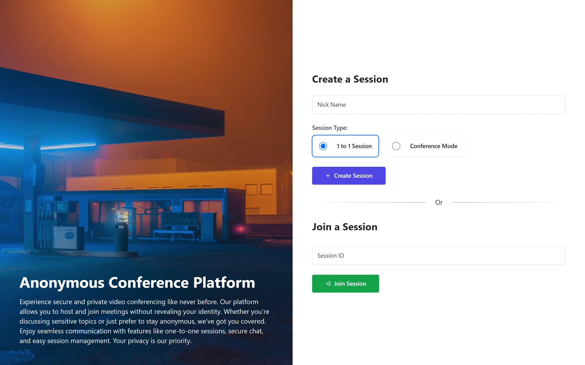
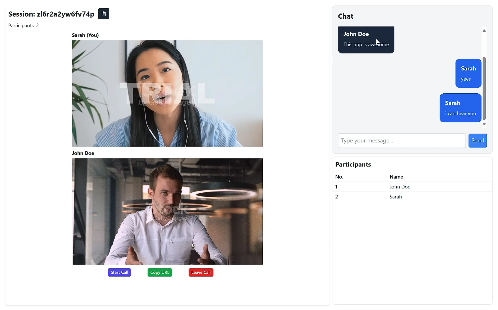

# Anonymous Conference Platform

Experience secure and private video conferencing like never before. Our platform allows you to host and join meetings without revealing your identity. Whether you're discussing sensitive topics or just prefer to stay anonymous, we've got you covered. Enjoy seamless communication with features like one-to-one sessions, secure chat, and easy session management. Your privacy is our priority.

## Features

- **Anonymous Video Conferencing**: Join and host meetings without revealing your identity.
- **One-to-One Sessions**: Secure private sessions for more intimate discussions.
- **Secure Chat**: Encrypted chat to keep your conversations private.
- **Easy Session Management**: Simple controls for starting, joining, and managing sessions.

## Screenshots





## Tech Stack

- **Frontend**: React, Tailwind CSS, Vite
- **Backend**: Express, Redis, Socket.io, Pocketbase
- **Database**: Redis, Pocketbase
- **Other Tools**: Docker, Docker Compose

## Installation

### Prerequisites

- Docker
- Docker Compose

### Steps

1. Clone the repository:
    ```sh
    git clone https://github.com/Shaunfurtado/ConferEase.git
    cd ConferEase
    ```

2. Build and start the containers:
    ```sh
    docker-compose up -d
    ```

3. Access the application:
    - Frontend: [http://localhost:5174](http://localhost:5174)
    - Backend: [http://localhost:5000](http://localhost:5000)

## Project Structure

```
.
├── backend
│   ├── Dockerfile
|   ├──routes
       ├──sessions.mjs
│   ├── server.mjs
│   ├── package.json
│   └── ...
├── frontend
│   ├── Dockerfile
│   ├── src
│   ├── public
│   ├── package.json
│   └── ...
├── docker-compose.yml
└── README.md
```

## Docker Configuration

### Dockerfile for Frontend

```Dockerfile
# Use the official Node.js 18 image
FROM node:18

# Set the working directory
WORKDIR /app

# Copy package.json and package-lock.json
COPY package*.json ./

# Install dependencies
RUN npm install

# Copy the rest of the application
COPY . .

# Expose the port used by Vite
EXPOSE 5174

# Start the Vite development server
CMD ["npm", "run", "dev"]
```

### Dockerfile for Backend

```Dockerfile
# Use the official Node.js 18 image
FROM node:18

# Set the working directory
WORKDIR /app

# Copy package.json and package-lock.json
COPY package*.json ./

# Install dependencies
RUN npm install

# Copy the rest of the application
COPY . .

# Expose the port used by the backend
EXPOSE 5000

# Run the backend server
CMD ["node", "--experimental-modules", "server.mjs"]
```

### Docker Compose Configuration

```yaml
version: '3.8'

services:
  frontend:
    build:
      context: ./frontend
      dockerfile: Dockerfile
    volumes:
      - ./frontend:/app
      - /app/node_modules
    ports:
      - "5174:5174"
    environment:
      - CHOKIDAR_USEPOLLING=true
    depends_on:
      - backend

  backend:
    build:
      context: ./backend
      dockerfile: Dockerfile
    volumes:
      - ./backend:/app
      - /app/node_modules
    ports:
      - "5000:5000"
    environment:
      - REDIS_HOST=redis
      - REDIS_PORT=6379
    depends_on:
      - redis

  redis:
    image: redis:latest
    ports:
      - "6379:6379"
    volumes:
      - redis-data:/data

volumes:
  redis-data:
```

## Contributing

Contributions are welcome! Please open an issue or submit a pull request for any improvements or additions.
